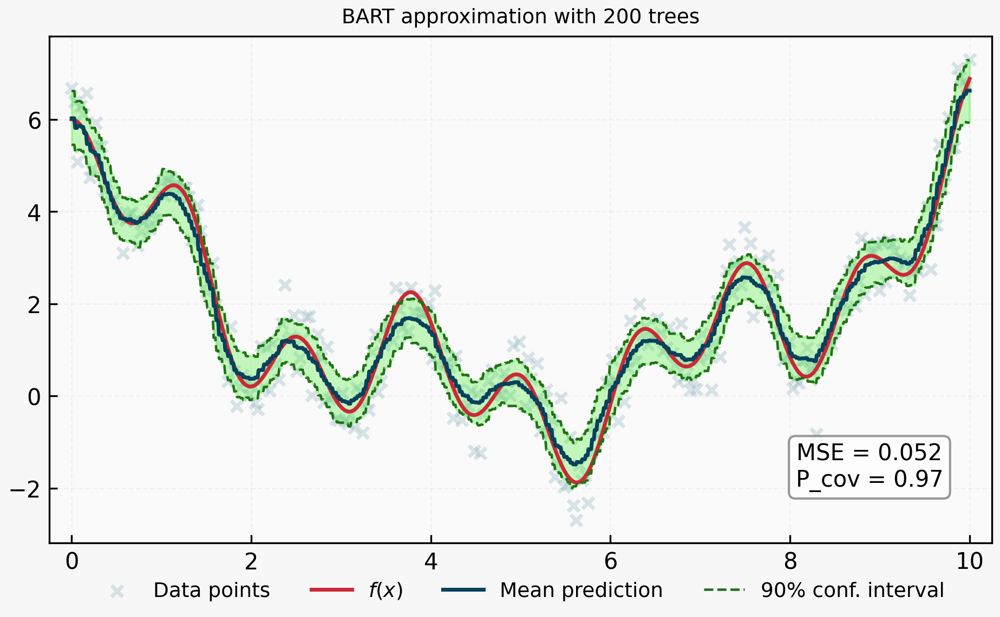
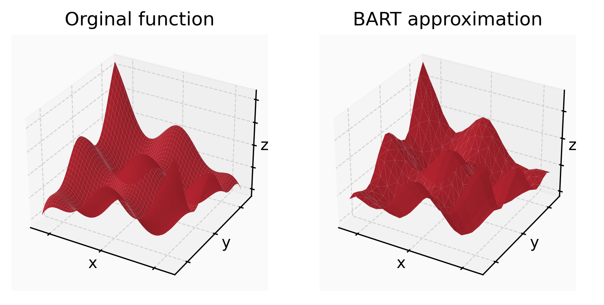

# GenBART

GenBART is a from-scratch Python/C++ implementation of **Bayesian Additive Regression Trees (BART)**.

GenBART started as part of my master's thesis work, but with the goal of building a practical general-purpose BART package.

- From-scratch implementation of **Bayesian Additive Regression Trees**
- **Regression BART** and **probit BART** interfaces
- **C++ backfitting engine** for tree updates and posterior sampling
- Posterior prediction with uncertainty summaries
- Variable importance and partial dependence utilities
- Example notebooks with 2D and 3D visualizations

## Preview

<p align="center">
  
</p>
<p align="center">
  
</p>

<p align="center">
  <em>Posterior function approximation examples from the accompanying notebooks.</em>
</p>


## What is BART?

BART is a Bayesian sum-of-trees model for regression and classification. It models a response variable as a **sum of many small regression trees**, resulting in a flexible nonlinear model. 

The individual trees are regularized to act as weak learners, and fitting is done with a **Bayesian backfitting MCMC algorithm**. This allows for simple posterior inference such as determining _uncertainty intervals_, _partial dependence_ or _variable importance_.

## Implemented components

### Python interface

- `RegBart` for regression
- `ProbitBart` for binary classification
- posterior prediction utilities
- variable importance
- partial dependence / effect summaries

### C++ backend

- tree grow, prune, change, and swap proposals
- Bayesian backfitting engine
- dense posterior forest representation for faster prediction


## Minimal example

```python
import numpy as np
from genbart.reg_bart import RegBart

rng = np.random.default_rng(0)
X = rng.uniform(0, 1, size=(200, 2))
y = np.sin(2 * np.pi * X[:, 0]) + X[:, 1] ** 2 + rng.normal(0, 0.1, size=200)

model = RegBart(m=200, n_burn=200, n_samples=1000, random_state=0)
model.fit(X, y)

pred = model.predict(X)
print(pred["prediction"][:5])
```

## Examples

Example notebooks are available in the [notebooks](notebooks/) directory.

- [Regression example](notebooks/basic_regression_example.ipynb)
- [Probit classification example](notebooks/basic_probit_example.ipynb)

## Status

GenBART is actively evolving. The core functionality is already usable for experimentation and research, while the API, documentation, and additional model variants are still under development.

## Reference

Chipman, H. A., George, E. I., and McCulloch, R. E. (2010). **BART: Bayesian Additive Regression Trees.**  *The Annals of Applied Statistics*, 4(1), 266-298.

## License

